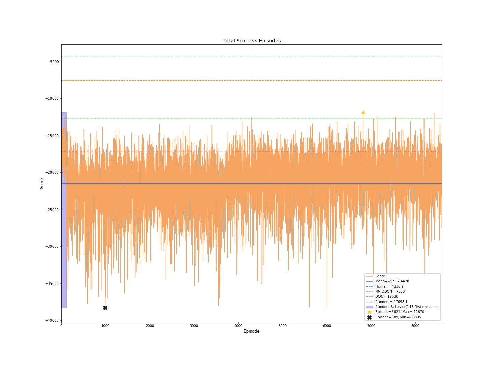

# Atari-Skiing-RL
Reinforcement Learning Project, on [Atari's skiing game](https://en.wikipedia.org/wiki/Skiing_(Atari_2600)), 
using [OpenAI Gym](https://gym.openai.com/) and [Keras](https://keras.io/).  

A **Deep Q-Network (DQN)**, which follows an **ε-greedy policy** is built from scratch and used 
in order to be self-taught to play the Atari Skiing game with continuous observation space.  
Techniques described in [Deepmind's paper](https://storage.googleapis.com/deepmind-media/dqn/DQNNaturePaper.pdf) are being used.  

The code can be easily extended in order to generate more agents (ex. DDQN) 
and try it in all the OpenAI Gym environments.  
Moreover, the agent's neural netork model architecture can be easily modified.

## Usage
There are multiple choices the user can make in order to run the script optimally:

```
usage: skiing.py [-h] [-fp FILENAME_PREFIX] [-rp RESULTS_NAME_PREFIX]
                 [-si SAVE_INTERVAL] [-rsi RESULTS_SAVE_INTERVAL]
                 [-iic INFO_INTERVAL_CURRENT] [-iim INFO_INTERVAL_MEAN]
                 [-ti TARGET_INTERVAL] [-a AGENT] [-ah AGENT_HISTORY] [-np]
                 [-nsp] [-p PLOT_NAME] [-nr] [-d DOWNSAMPLE] [-s STEPS]
                 [-ff FIT_FREQUENCY] [-no NO_OPERATION] [-e EPISODES]
                 [-eps EPSILON] [-feps FINAL_EPSILON] [-deps DECAY]
                 [-o OBSERVE] [-rm REPLAY_MEMORY] [-b BATCH] [-g GAMMA]
                 [-opt {adam,rmsprop,sgd,adagrad,adadelta,adamax}]
                 [-lr LEARNING_RATE] [-lrd LEARNING_RATE_DECAY] [-b1 BETA1]
                 [-b2 BETA2] [-rho RHO] [-f FUZZ] [-m MOMENTUM]

Trains a DQN agent to play the Atari Skiing game.

optional arguments:
  -h, --help            show this help message and exit
  -fp FILENAME_PREFIX, --filename_prefix FILENAME_PREFIX
                        Filename prefix for the trained model to be saved
                        (default out/models/atari_skiing).
  -rp RESULTS_NAME_PREFIX, --results_name_prefix RESULTS_NAME_PREFIX
                        Filename prefix for the results history to be saved
                        (default out/results/atari_skiing).
  -si SAVE_INTERVAL, --save_interval SAVE_INTERVAL
                        The save interval for the trained model (default 100),
                        in episodes.
  -rsi RESULTS_SAVE_INTERVAL, --results_save_interval RESULTS_SAVE_INTERVAL
                        The save interval for the results history (default
                        100), in episodes.Insert a negative value to not save
                        the results history.
  -iic INFO_INTERVAL_CURRENT, --info_interval_current INFO_INTERVAL_CURRENT
                        The current scoring information interval (default 20),
                        in episodes.
  -iim INFO_INTERVAL_MEAN, --info_interval_mean INFO_INTERVAL_MEAN
                        The mean scoring information interval (default 100),
                        in episodes.
  -ti TARGET_INTERVAL, --target_interval TARGET_INTERVAL
                        The target model change interval (default 10000), in
                        steps.
  -a AGENT, --agent AGENT
                        Filepath for a trained agent to be loaded (default ).
  -ah AGENT_HISTORY, --agent_history AGENT_HISTORY
                        The agent's frame history (default 4).
  -np, --no_plot        Whether the train results should not be plot.
  -nsp, --no_save_plots
                        Whether the train results plots should not be saved.
  -p PLOT_NAME, --plot_name PLOT_NAME
                        Filename prefix for the plots to be saved (default
                        out/plots/atari_skiing).
  -nr, --no_render      Whether the environment should not be rendered.
  -d DOWNSAMPLE, --downsample DOWNSAMPLE
                        The downsampling scale to be used (default 2).
  -fs FRAME_SKIPPING, --frame_skipping FRAME_SKIPPING
                        The frames to skip per action (default 4).
  -ff FIT_FREQUENCY, --fit_frequency FIT_FREQUENCY
                        The actions to take between an agent's fit (default
                        4).
  -no NO_OPERATION, --no_operation NO_OPERATION
                        The maximum number of no operation steps at the
                        beginning of the game (default 30).
  -e EPISODES, --episodes EPISODES
                        The episodes to run the training procedure (default
                        10000).
  -eps EPSILON, --epsilon EPSILON
                        The epsilon for the e-greedy policy (default 1.0).
  -feps FINAL_EPSILON, --final_epsilon FINAL_EPSILON
                        The final epsilon for the e-greedy policy (default
                        0.1).
  -deps DECAY, --decay DECAY
                        The epsilon decay for the e-greedy policy (default
                        0.0001).
  -o OBSERVE, --observe OBSERVE
                        The total number of observing steps before the
                        training begins, thus taking random actions (default
                        10000).
  -rm REPLAY_MEMORY, --replay_memory REPLAY_MEMORY
                        The replay memory to be used for the agent (default
                        400000).
  -b BATCH, --batch BATCH
                        The batch size to be randomly sampled from the memory
                        for the training (default 32).
  -g GAMMA, --gamma GAMMA
                        The discount factor (default 0.99).
  -opt {adam,rmsprop,sgd,adagrad,adadelta,adamax}, --optimizer {adam,rmsprop,sgd,adagrad,adadelta,adamax}
                        The optimizer to be used. (default RMSProp).
  -lr LEARNING_RATE, --learning_rate LEARNING_RATE
                        The learning rate for the optimizer (default 0.00025).
  -lrd LEARNING_RATE_DECAY, --learning_rate_decay LEARNING_RATE_DECAY
                        The learning rate decay for the optimizer (default
                        1e-06).
  -b1 BETA1, --beta1 BETA1
                        The beta 1 for the optimizer (default 0.9).
  -b2 BETA2, --beta2 BETA2
                        The beta 2 for the optimizer (default 0.999).
  -rho RHO              The rho for the optimizer (default 0.95).
  -f FUZZ, --fuzz FUZZ  The fuzz factor for the rmsprop optimizer (default
                        0.01).
  -m MOMENTUM, --momentum MOMENTUM
                        The momentum for the optimizer (default 0.1).
```

## Results
The results are not optimal, because of hardware limitations, 
though we can observe the effectiveness of the methods applied.

#### Score vs Episodes


#### Untrained vs Trained Performance


## Future Enhancements
- Add more agents and choose between them through the CLI.
- Add choices for the Open Ai Gym environment to be used through the CLI.
